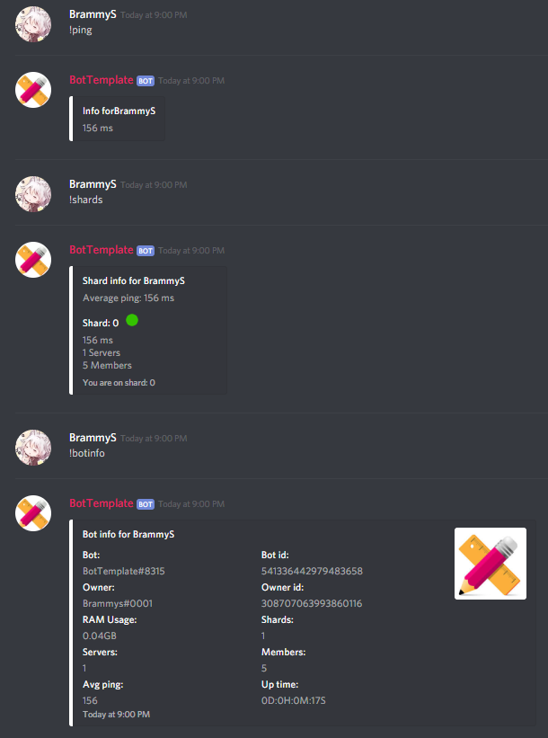
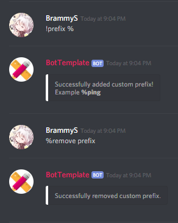

# Discord Bot Template

This is an advanced c# discord bot template. With sharding and EF core and more!

## What Bot templates Are Available?
You can switch bot templates by switching branches.
1. A basic bot with sharding and basic command.
2. A bot with a database using Entity framework + the same features as template 1.

## Cloning

These instructions will get you a copy of the bot up and running on your local machine for development and testing purposes.

1. Clone one of the bot templates.
2. Fill in all the Data for your bot in the [Constants class](https://github.com/BramEsendam/BotTemplate/blob/master/Bot/Constants.cs).
3. Start the bot. This will create one or more config files in your debug/release folder of your project. 
4. Please follow the steps below for the bot template that you chose.
   * Basic bot: Add your bot token to the ConfigData.json file.
   * Entity framework bot: Follow the Basic bot steps above + follow the migration steps in the [BotContext](https://github.com/BramEsendam/BotTemplate/blob/master/Bot.Persistence.EntityFrameWork/BotContext.cs) go to [here](https://docs.microsoft.com/en-us/ef/core/get-started/netcore/new-db-sqlite) for more info on migrations.
5. Enjoy your bot!

## Features

#### Basic bot

#### Entity framework bot

## Built With

* [Discord.Net](https://github.com/discord-net/Discord.Net) - An unofficial .Net wrapper for the Discord API.
* [EF core](https://docs.microsoft.com/en-us/ef/core/) - The object-relational mapper.
* [Unity](https://github.com/unitycontainer) - Used for dependency injection.

## Authors

* **Bram Esendam** - *Initial work* - [GitHub](https://github.com/BramEsendam)

See also the list of [contributors](https://github.com/BramEsendam/BotTemplate/contributors) who participated in this project.

## License

This project is licensed under the MIT License - see the [LICENSE](LICENSE) file for details
